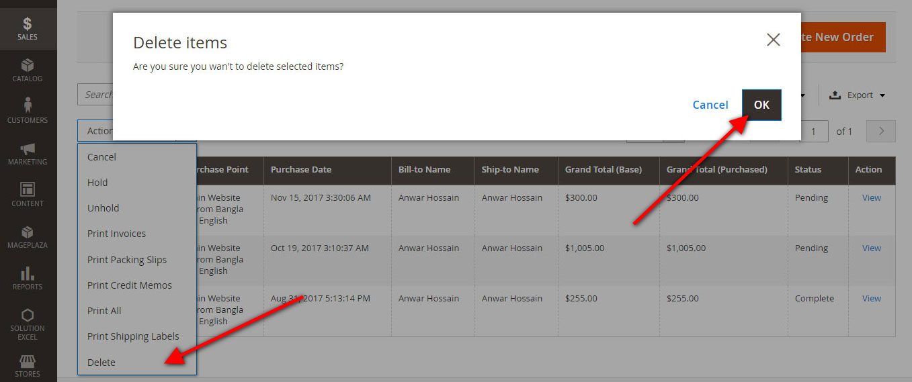
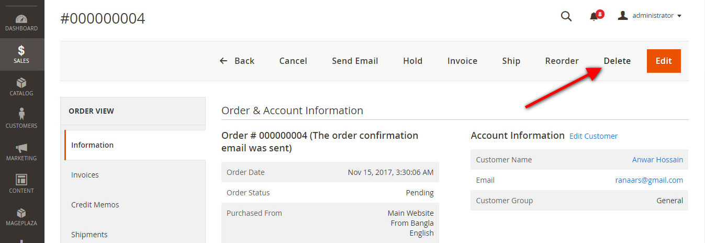

# Magento 2 Delete Orders Extension
Magento 2 delete single or multiple order.

## Compatible With:
Magento 2

## Available Features:
* Multiple or Single order delete from backend order gird using massaction.
* Manually delete single order from order view page.
* Automatically remove/delete order invoice if exists.
* Automatically remove/delete order shipment if exists.
* Automatically remove/delete credit memo comments and others data along with orders.

## Multiple or Single order delete from order gird
[](/uri)

## Single order delete from view page
[](/uri)

## Installation
##### Using Composer (Recommended)

```
composer require ecomteck/module-delete-orders

```
##### Manually (not recommended)
 * Download DeleteOrders Extension
 * Unzip the magento2-delete-orders-master.zip file
 * Create a folder {Magento 2 root}/app/code/Ecomteck/DeleteOrders
 * Copy all files and folder to DeleteOrders folder

#### Step 2 - Enable/Install via command line 
 * php bin/magento module:enable --clear-static-content Ecomteck_DeleteOrders
 * php bin/magento setup:upgrade
 * php bin/magento cache:flush

If you have any inquiry please contact with me via email or skype.
* Email: [ecomteck@gmail.com](mailto:ecomteck@gmail.com)
* Skype: ecomteck
* Web: [Ecomteck Solution](https://www.ecomteck.com/)